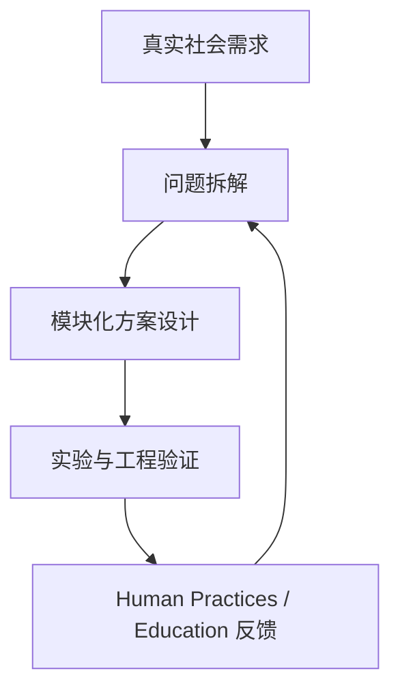

# 🌱 Shirley Xie ｜谢霁凌  

<b>专业：</b>临床医学（五年制） 
<b>年级：</b>2024 级 
<b>核心兴趣：</b>
Human Practices ·
Science Communication ·
Medical Visualization

---

## 🎨 学生工作

### 团委学生艺术团公共艺术课堂 网宣部部长
参与策划过**15+项**活动，其中包括2025毕晚公关组核心

### 医学可视化协会 副社长兼宣传部部长

在医学可视化协会中，我长期承担**连接科学与公众**的角色：

- 📢 公众号 / 小红书 / B 站媒体运营  
- 🎥 医学科普视频剪辑与视觉呈现  
- 🖼️ 百团大战线下摊位整体视觉与宣传策划  

**部分量化成果：**

| 项目 | 数据 |
|---|---|
| 百团大战 | 单场 100+ 人次关注 |
| 全平台浏览 | 6500+ |
| 点赞数 | 1000+ |

---
## 🧪 技能概览 | Skill Set

### 🎨 设计与科学传播

- **美工设计**：秀米 / 可画 / Photoshop / Adobe Illustrator 
- **科研制图**：BioRender / Adobe Illustrator
- **视频制作**：视频策划、剪辑 

### 🧠 综合与跨界能力

- 📢 **宣传展示**：线下招新、展会讲解、PPT 与宣传物料设计  
- 🤝 **Human Practices**：政策调研、公众访谈、科普课程与活动设计  
- 🌍 **英文交流**：中级口译证书、FET 口语A、UBC暑校 

### 🎶 实践经历

- 2024春 “医”路昂扬，“保”民平安——以徐汇区和杨浦区为例调研上海市民众医疗保险参保情况和参保意愿 A 
- 2024夏 旦心远征，星火“屯”梦——2024暑期河南汝州小屯一中支教行 A
- 2024秋 “医路相伴，科研赋能”——秋季科研制图教学训练营A
- 2025春 智“绘”医疗--Nomad3D医学建模艺术探索 A
- 2025春 绘聚“医”心——医学可视化插画比赛 A
等总计 15+项 日常实践化项目

- 2023上海医学论坛
- 2024夏 河南骑岭乡中支教（副领队）
- 2025第八届进博会香港馆
等总计志愿时长 500+小时

---

## 🧠 我如何理解 iGEM？

在系统阅读与分析多支优秀队伍项目后，  
我逐渐形成了对 **“一个好的 iGEM 项目”** 认识：

---

## 🔍 从优秀队伍中我学到的事

### 🧯 从 EPFL 项目中学到的

- 工程并非一次性成功，而是 **失败 → 调整 → 再构建** 的持续迭代过程  
- **Human Practices 并非附属材料**，而是工程可靠性与安全性的关键组成部分  
- 项目应从一开始就与 **真实用户、监管机构及行业专家** 保持持续互动  

### 🌱 从 SZU-China 项目中学到的

- 优秀设计并非单一技术突破，而是 **系统化的问题解决方案**  
- 将复杂问题拆分为多个功能模块，并通过 **模块协同** 应对真实应用场景  
- 生物系统的价值，在于是否能够 **长期、稳定地被真实使用者接受与采用**

### 📌 这些理解将直接指导我在团队中参与：

- **Human Practices** 的整体设计与迭代  
- **Education** 活动的内容构建与传播路径  
- **Wiki** 的叙事结构规划与逻辑呈现  

 

## 图片压缩流程

1. 原始图片格式：PNG / JPG（相机或截图原图）
2. 压缩工具：[TinyPNG](https://tinypng.com)
3. 处理方式：
   - 去除冗余元数据（metadata）
   - 优化色彩信息与编码方式
4. 输出

**选择该方案的原因：**

- 在保证图片清晰度的前提下显著降低文件体积  
- 提升网页加载速度与阅读体验  
- 符合 iGEM Wiki 对单张图片大小（< 5 MB）的规范要求

